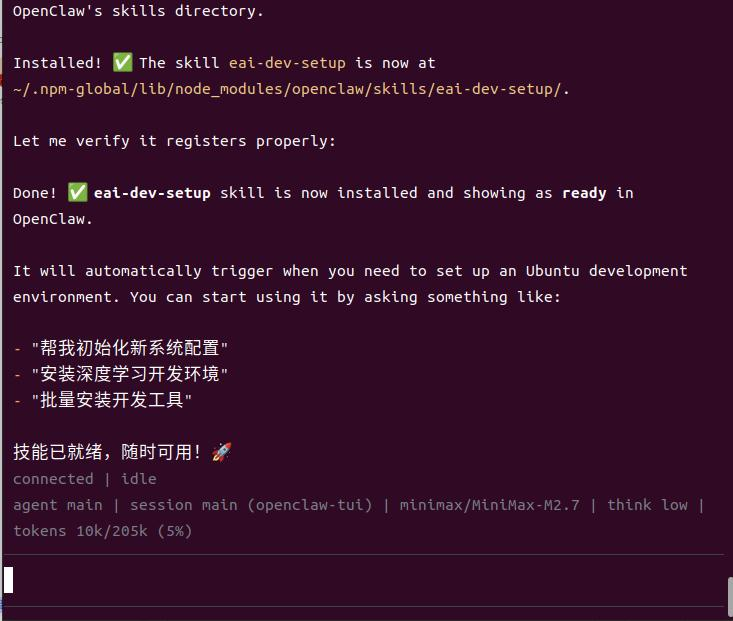
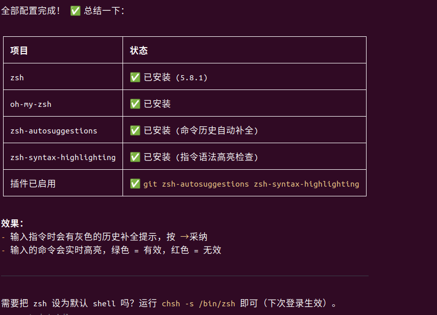
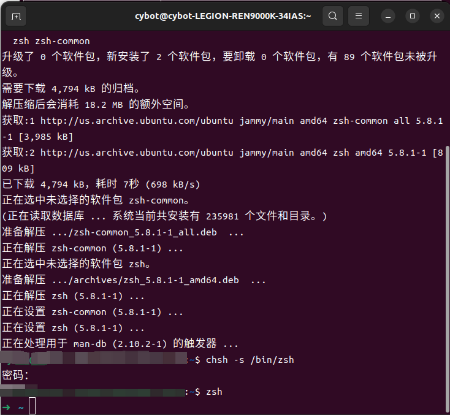
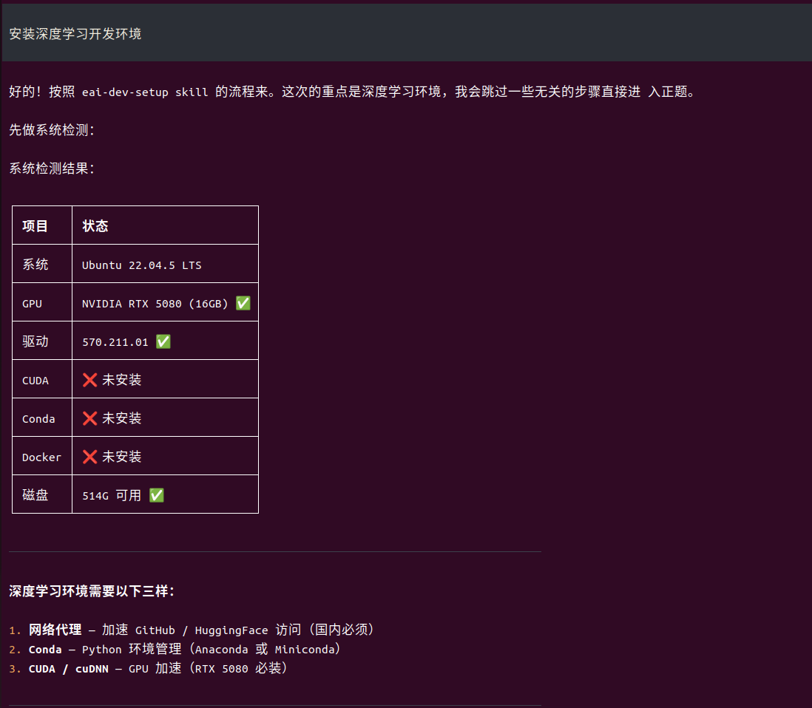
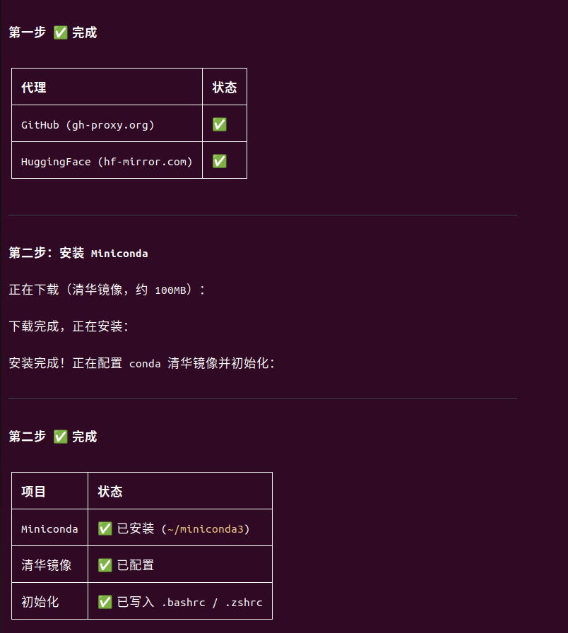

# EAI-Dev-Setup

[](https://clawhub.ai/skills/eai-dev-setup)
[](https://skillhub.tencent.com)
[](https://github.com/Jessy-Huang/Embodied_ubuntu-dev-setup)
[](LICENSE)

**EAI-Dev-Setup** 是一个自动化配置 Ubuntu 算法开发环境的 Skill，针对中国网络环境进行了深度优化。

## ✨ 功能特性

### 🌐 国内网络优化
- **GitHub 代理**：使用 gh-proxy.org 加速所有 GitHub 访问
- **HuggingFace 镜像**：使用 hf-mirror.com 加速模型下载
- **Docker 镜像**：使用阿里云镜像安装和加速
- **pip/conda 镜像**：配置清华、阿里云镜像源
- **oh-my-zsh 镜像**：使用 Gitee 镜像安装

### 🛠️ 自动化安装
- **基础工具**：Chrome、Edge、VSCode、Cursor、飞书等
- **开发环境**：Docker、Conda、CUDA、cuDNN、ROS
- **终端工具**：Terminator、Zsh + Oh-My-Zsh
- **其他工具**：Kazam、GParted、ToDesk 等

### 📊 用户友好
- 分步引导安装流程
- 每步询问用户确认
- 进度提示和时间预估
- 下载进度条显示
- sudo 操作需用户明确同意

## 📋 支持的工具

| 分类 | 工具 |
|------|------|
| 浏览器 | Chrome、Edge、Firefox |
| 编辑器 | VSCode、Cursor |
| 办公通讯 | 飞书、ToDesk、腾讯会议、WPS、搜狗输入法 |
| 开发环境 | Docker、Conda/Anaconda、CUDA、cuDNN、ROS |
| 终端工具 | Terminator、Zsh、Oh-My-Zsh |
| 其他工具 | Kazam、GParted、Clash Verge |

## 🚀 安装方式

> 参考 [SkillHub 安装指南](https://skillhub.tencent.com/#categories)

### 方式一：Agent 方式安装（推荐）

通过 AI Agent 自动安装，支持以下渠道：

#### ClawHub 渠道
```bash
npx clawhub@latest install eai-dev-setup
```

#### GitHub 渠道
```bash
npx skillhub install eai-dev-setup --no-api
```

### 方式二：Human 方式安装

手动下载并安装：

```bash
# 克隆仓库
git clone https://github.com/Jessy-Huang/Embodied_ubuntu-dev-setup.git

# 或下载 .skill 文件
wget https://clawhub.ai/skills/eai-dev-setup/download
```

### 安装成功



## 🤖 在 OpenClaw 中使用

### 安装 OpenClaw

OpenClaw 是一个强大的 AI Agent 平台，支持加载和运行 Skill。

- **官方网站**：https://openclaw.ai
- **GitHub**：https://github.com/openclaw
- **安装教程**：参考 [OpenClaw 快速开始](https://github.com/openclaw/clawhub#quick-start)

```bash
# 使用 npm 安装 ClawHub CLI
npm install -g clawhub

# 或使用 npx 直接运行
npx clawhub@latest --help
```

### 使用自然语言测试 Skill

安装 Skill 后，在 OpenClaw 中直接使用自然语言与 Agent 交互，Agent 会自动调用 Skill 完成任务。

#### 测试一：安装 Zsh





**用户输入示例**：
```
帮我安装 zsh 和 oh-my-zsh，使用国内镜像加速
```

#### 测试二：配置深度学习开发环境





**用户输入示例**：
```
帮我配置深度学习开发环境，安装 Docker 和 Conda
```

#### 测试三：安装常用软件

**用户输入示例**：
```
帮我安装以下软件：飞书、VSCode、Chrome
```

**更多指令示例**：
```
# 安装终端工具
帮我安装 Terminator 终端

# 安装远程桌面
帮我安装 ToDesk 远程控制软件

# 安装录屏工具
帮我安装 Kazam 录屏软件

# 配置 HuggingFace 镜像
帮我配置 HuggingFace 镜像源，加速模型下载

# 完整环境配置
帮我配置一个完整的深度学习开发环境，包括 Docker、Conda、CUDA 驱动
```

## 📚 文档

- [工具清单](eai-dev-setup/references/tools_guide.md) - 完整的工具列表和安装说明
- [CUDA 指南](eai-dev-setup/references/cuda_guide.md) - CUDA/cuDNN 详细配置步骤
- [配置模板](eai-dev-setup/references/config_templates.md) - 配置文件模板和镜像源配置

## 🔧 脚本说明

| 脚本 | 功能 |
|------|------|
| `system_check.py` | 检测 Ubuntu 系统信息 |
| `install_package.py` | 统一的软件包安装工具 |
| `install_docker.py` | Docker 安装（阿里云镜像） |
| `config_env.py` | 配置文件和环境变量管理 |
| `setup_zsh.py` | Zsh 和 Oh-My-Zsh 配置 |

## 🌍 国内镜像源汇总

| 类型 | 镜像源 | 地址 |
|------|--------|------|
| GitHub | gh-proxy | `https://gh-proxy.org/https://github.com/` |
| HuggingFace | hf-mirror | `https://hf-mirror.com` |
| pip | 清华 | `https://pypi.tuna.tsinghua.edu.cn/simple` |
| conda | 清华 | `https://mirrors.tuna.tsinghua.edu.cn/anaconda/` |
| Docker | 阿里云 | `https://mirrors.aliyun.com/docker-ce/` |
| oh-my-zsh | Gitee | `https://gitee.com/shmhlsy/oh-my-zsh-install.sh` |
| apt | 清华 | `https://mirrors.tuna.tsinghua.edu.cn/ubuntu/` |

## 📦 发布平台

本 Skill 已发布到以下平台：

| 平台 | 地址 | 说明 |
|------|------|------|
| **ClawHub** | https://clawhub.ai/skills/eai-dev-setup | 国际平台，支持 Agent 自动安装 |
| **SkillHub** | https://skillhub.tencent.com | 腾讯云平台，专为中国用户优化 |
| **GitHub** | https://github.com/Jessy-Huang/Embodied_ubuntu-dev-setup | 源码仓库 |

## ⚠️ 注意事项

1. **权限要求**：涉及 sudo 权限的操作会提示用户确认
2. **禁止删除**：不会删除任何已有文件或配置
3. **重启提示**：安装 NVIDIA 驱动或 CUDA 后需要重启系统
4. **网络问题**：建议先配置 GitHub 代理再执行其他安装

## 🤝 贡献

欢迎提交 Issue 和 Pull Request！

## 📄 许可证

[MIT-0](LICENSE) - 自由使用、修改和分发，无需署名。

---

**作者**: [@Jessy-Huang](https://github.com/Jessy-Huang)
